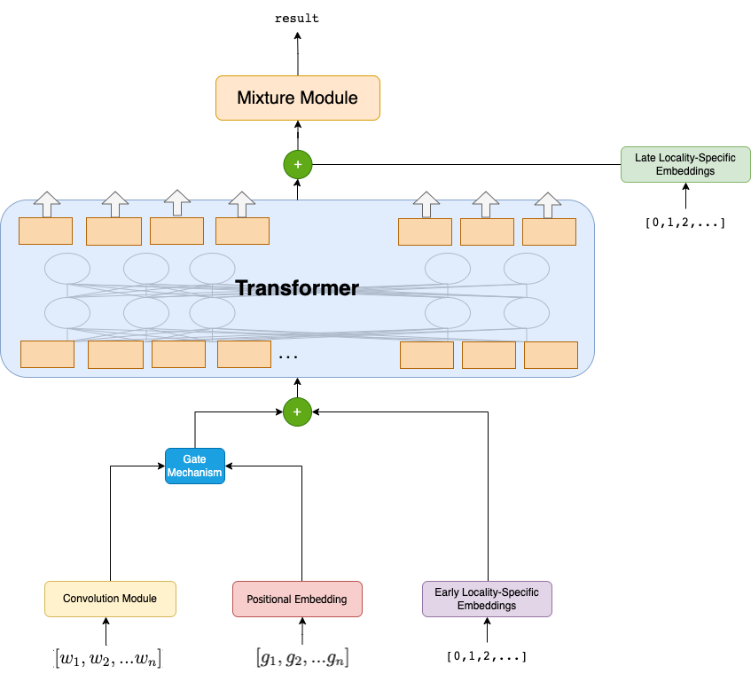
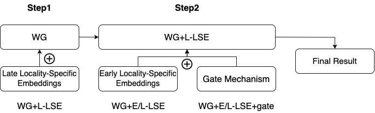

# SENSE: An Attention-based Framework for Earthquake Early Warnings

This repository contains the code and implementation for our paper:

**"An Attention-based Framework with Multistation Information for Earthquake Early Warnings"**  
Yu-Ming Huang, Kuan-Yu Chen, Wen-Wei Lin, and Da-Yi Chen  

## 📖 Introduction
Earthquake early warning systems (EEWS) play a crucial role in disaster risk reduction. Traditionally, single-station models have been widely used, but they often fail to consider global information across multiple seismic stations, leading to limitations in performance. 

In this study, we propose **SENSE**, a deep-learning-based framework that integrates multistation information to enhance earthquake intensity predictions. By leveraging self-attention mechanisms, SENSE captures both local station characteristics and broader regional seismic patterns. Our results, evaluated on datasets from **Taiwan and Japan**, demonstrate that SENSE outperforms existing state-of-the-art methods in early warning accuracy.

## 🚀 Features
- **Multistation Data Integration**: Utilizes information from multiple seismic stations instead of relying on a single station.
- **Self-Attention Mechanism**: Captures relationships between stations to improve prediction accuracy.
- **Deep Learning Model**: Based on Transformer-like architectures for seismic event forecasting.
- **Evaluated on Taiwan & Japan Datasets**: Demonstrates superior performance over traditional methods.

## **Model Structure**



## **Training Workflow**
The training process follows a structured pipeline, as illustrated below:



## **Usage**

### **Training**
To train the model, use the following command:
```bash
CUDA_VISIBLE_DEVICES=<GPU_ID> python3 train.py –config <path_to_config>

- `<GPU_ID>`: Specifies which GPU to use. Example: `0` for the first GPU.
- `<path_to_config>`: Path to the configuration file. Example: `pga_configs/transformer_japan.json`.

**Example:**
CUDA_VISIBLE_DEVICES=0 python3 train.py –config pga_configs/transformer_japan.json
```

### **Evaluation**
To evaluate the model on a test dataset, use:
```bash
CUDA_VISIBLE_DEVICES=<GPU_ID> python3 evaluate_250.py –experiment_path <path_to_model_output>

- `<path_to_model_output>`: Directory containing the trained model and parameters.

**Example:**
CUDA_VISIBLE_DEVICES=0 python3 evaluate_250.py –experiment_path experiments/model_v1/
```